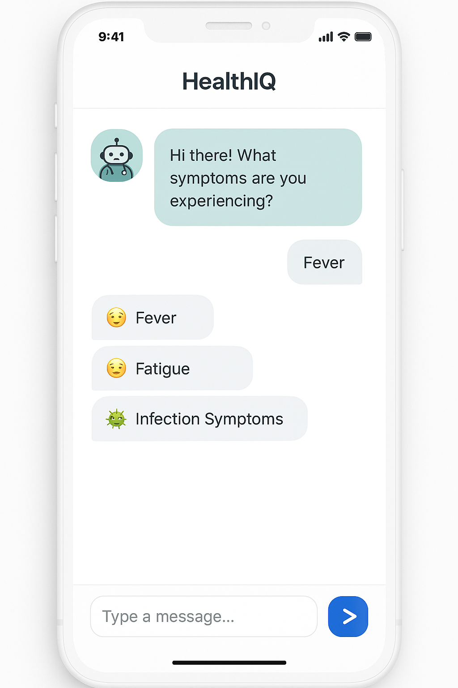

# 🤖 HealthIQ – AI Symptoms Checker

HealthIQ is an AI-powered mobile application that allows users to check symptoms, receive possible condition predictions, and get medication recommendations using natural language input or voice.

> ⚠️ **Note**: This is an Android app. To run it, please use an Android emulator or a physical Android device.

---

## 🚀 Features

- 🔍 **AI Symptom Checker** – Input symptoms through text or voice and get condition predictions.
- 💬 **Chatbot Interface** – Interactive chat with guided prompts or free-text input.
- 🧠 **AI-Powered Diagnosis** – Backend powered by FastAPI and AI models for real-time predictions.
- 💊 **Medication Suggestions** – Recommends possible treatments with dosage and image previews.
- 🎙️ **Voice Input Support** – Speak your symptoms with built-in speech recognition.
- 📊 **User-Friendly UI** – Built with Flutter and Material Design for a smooth experience.

---

## 📱 Screenshots


---

## 🛠 Tech Stack

| Technology | Description |
|------------|-------------|
| **Flutter** | UI framework for Android & iOS |
| **FastAPI** | Backend API for AI predictions |
| **Python** | Language used for AI and data processing |
| **SQLite** | Local storage for user history and preferences |
| **Speech to Text** | Voice input using `speech_to_text` package |

---

## ⚙️ Installation

1. **Clone the repository:**
   ```bash
   git clone https://github.com/Muchirik/healthiq.git
   cd healthiq
2. **Install Dependencies:**
   ```bash
   flutter pub get
3. **Run Android Emulator or device**
   ```bash
   flutter run
4. **Setup FastAPI Backend:**
   Navigate to 
   ```bash  
    cd /backend
   #Create and Activate Virtual environment
   #Install dependencies:
   pip install -r requirements.txt
5. **Run FastAPI Server:**
   ```bash
   uvicorn main:app --reload

## 🔮 Coming Soon
.ios Support
.symptom image/video input
.Health Report and recommendations
.Medical History Tracking
.Dark Mode and personalization


## Licence
This Project is licenced under the **MIT LICENCE**

## 📬 Contact

Got feedback, ideas, or questions?  
Reach out on [LinkedIn](https://www.linkedin.com/in/kenneth-muchiri-muongi/) or [open an issue](https://github.com/Muchirik/HealthIQ/issues) on this repository.


   
